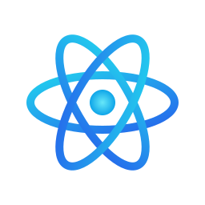
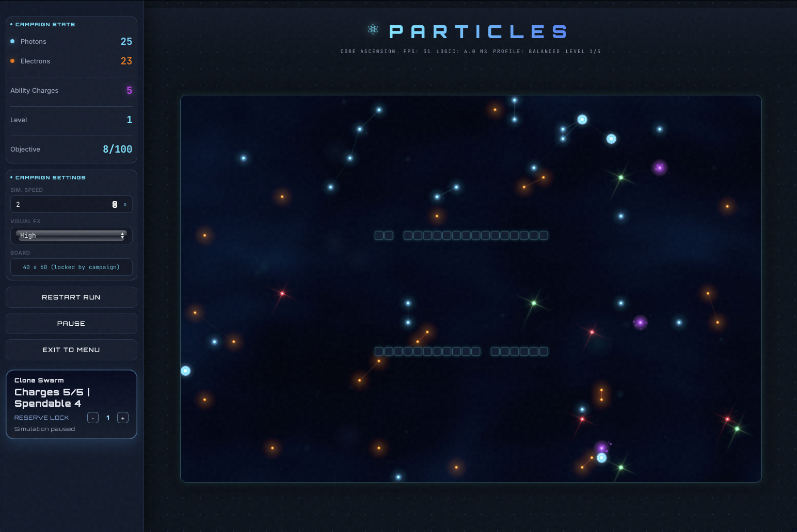
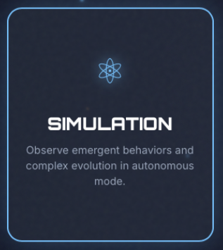

<p align="center">
	
</p>

<h1 align="center">P A R T I C L E S</h1>

<p align="center">
	
</p>

<p align="center">
	
	
	
	
	
</p>

Real-time particle strategy simulation/game with a web interface and a progressive campaign mode.

<p align="center">
	
</p>

### Overview 🔭

PARTICLES lets you observe and play with two core factions:

- 🔵 Photon (runners)
- 🟠 Electron (chasers)

Each faction has distinct mechanics such as combat, healing, speed boosts, energy node interactions, and obstacle pressure.

### Project Origin 🧬

This project is based on the Java project **Particles** from:

- https://github.com/mpjmar/Particles-java.git

This repository extends that idea into a web-focused implementation with multiple gameplay modes and UI systems.

### Game Modes 🎮

-  Simulation: autonomous mode (watch-only, no manual actions).
- ⚡ Pulse Clash: configurable player-vs-system mode (board size, speed, density and spawn settings).
- 🛸 Core Ascension: level-based campaign with objectives, transitions and increasing difficulty.

### Mode Matrix 🧭

| Mode | Style | Input | Best For |
|---|---|---|---|
|  Simulation | Autonomous | None | Visual observation and tuning |
| ⚡ Pulse Clash | Player vs System | Tap/Click + Ability | Fast tactical matches |
| 🛸 Core Ascension | Progressive campaign | Tap/Click + Reserve Lock | Long-run progression |

### How To Play (Quick Start) 🕹️


1. Open the mode you want from the main menu.
2. Press `BEGIN`/`START` to launch the match.
3. Watch your faction counters and `Ability Charges`.
4. Click on Energy Nodes to recover charges.
5. Use your ability only when it creates value (avoid wasting charges).

#### Pulse Clash / Core Ascension


**ENGLISH:**
- If you play as Photon: Click near or on an Electron to trigger an explosion that destroys it.
- If you play as Electron: Click near or on a Photon to generate a cluster of new Electrons to hunt them down.
- You can recharge your shot reserve by clicking on Energy Nodes that appear temporarily during the game.

**ESPAÑOL:**
- Si juegas como Photon: Pulsa cerca o sobre un electrón para provocar una explosión que lo destruya.
- Si juegas como Electron: Pulsa cerca o sobre un fotón para generar un clúster de nuevos electrones para acabar con ellos.
- Puedes recargar tu reserva de disparos pulsando sobre los Nodos de Energía que aparecen temporalmente durante la partida.

Pulse Clash:
1. Pick side: Photon or Electron.
2. Click board to use ability.
3. Photon: area shockwave (clear nearby enemies).
4. Electron: clone burst (create pressure with extra allies).
5. Win by eliminating the opposing faction.

Core Ascension:
1. Complete each level objective to advance.
2. The ability you use depends on your side.
3. If you play as Photon, clicking near or on an Electron will trigger an area explosion that removes nearby Electrons.
4. If you play as Electron, clicking near or on a Photon will summon more Electrons that will chase the Photons. Try to use your charges when there are many Photons together or when you are in danger, so your ability is most effective.
5. You can have a maximum of 5 ability charges on both sides.
6. Recover your charges by clicking on Energy Nodes.
7. Keep an eye on `Reserve Lock` to avoid running out of emergency charges.
8. Adjust Reserve Lock with the HUD `[-]/[+]` or arrow keys.
9. Spend your charges when there are many enemies together or when the situation is most dangerous, so you get the most value from your abilities.
10. Survive transitions and scale into the next stage.

Simulation:
1. No manual control required.
2. Tune settings (density, speed, quality).
3. Observe interactions and balance behavior.

### Visual Preview 🖼️

<p align="center">
	<a href="https://mpjmar.github.io/Particles/simulation.html">
		
	</a>
	<a href="https://mpjmar.github.io/Particles/game_selection.html">
		
	</a>
	<a href="https://mpjmar.github.io/Particles/levels_selection.html">
		
	</a>
</p>

### Highlights ✨

- 🧠 Grid-based simulation engine.
- 📱 Responsive UI for desktop and mobile (portrait and landscape).
- 📊 Real-time HUD with match/resource feedback.
- 🔋 Ability charges with energy node recovery.
- 🔐 Reserve Lock system in Core Ascension mode.
- 🎯 Per-level balancing (density, enemy life, spawn pace).
- 💾 Local persistence for selected settings and metrics.

### Tech Stack 🛠️

- HTML5
- CSS3
- JavaScript (runtime core)
- TypeScript (source structure in `web/src`)

### Repository Structure 🗂️

- `web/`: main web application.
- `web/index.html`: mode selection entry point.
- `web/simulation.html`: Simulation mode page.
- `web/game_selection.html`, `web/game.html`: Pulse Clash mode pages.
- `web/levels_selection.html`, `web/levels.html`: Core Ascension mode pages.
- `web/main.js`: base engine (simulation, render, loop).
- `web/game.js`: Pulse Clash mode logic.
- `web/levels.js`: Core Ascension campaign logic.
- `web/src/`: modular TypeScript source reference.
- `imgs/`: image assets.

### Local Setup 🚀

Recommended: Node.js 18+

1. Go to the web folder:

```bash
cd web
```

2. Install dependencies:

```bash
npm install
```

3. Start local server:

```bash
npm run dev
```

4. Open the URL shown by the command (typically `http://localhost:3000`).

### Available Scripts 📜

From `web/`:

- `npm run dev`: run local static server.
- `npm run build`: compile TypeScript.
- `npm run watch`: compile TypeScript in watch mode.

### Deploy on GitHub Pages 🌐

This repository includes an automated workflow at `.github/workflows/deploy-pages.yml`.

1. Push your project to GitHub (default branch: `main`).
2. Open repository `Settings` > `Pages`.
3. In `Build and deployment`, set `Source` to `GitHub Actions`.
4. Push to `main` (or run the workflow manually from `Actions`).
5. When the workflow finishes, your site will be available at:

```text
https://<your-username>.github.io/<your-repo>/
```

### Core Ascension Controls 🎛️

- Goal: complete each level objective to continue.
- Click board with Photon: create an area explosion (kills nearby Electrons).
- Click board with Electron: spawn Electron clusters (to hunt Photons).
- Ability charges are capped at 5 for both sides.
- Click Energy Nodes: recover ability charges.
- HUD `[-]/[+]`: adjust Reserve Lock.
- Arrow keys Left/Right: adjust Reserve Lock quickly.
- Charges at/below Reserve Lock: ability use is blocked.


### Status 📡

Active development focused on UX clarity, high-density stability, and faction balance.

<p align="center"><strong>ENGLISH VERSION</strong> 🇬🇧</p>

<hr>

<p align="center"><strong>VERSION EN ESPANOL</strong> 🇪🇸</p>


### Resumen 🔭

PARTICLES es un simulador/juego de estrategia en tiempo real basado en sistemas de particulas, con interfaz web y campaña por niveles.

<p align="center">
	
</p>

Permite observar y jugar con dos facciones principales:

- 🔵 Photon (runners)
- 🟠 Electron (chasers)

Cada faccion tiene mecanicas propias: combate, curacion, mejoras de velocidad, nodos de energia y gestion de obstaculos.

### Origen del Proyecto 🧬

Este proyecto esta basado en el proyecto en Java **Particles** del repositorio:

- https://github.com/mpjmar/Particles-java.git

Este repositorio traslada y amplia esa base hacia una implementacion web con varios modos y sistemas de interfaz.

### Modos de Juego 🎮

-  Simulation: modo autonomo (solo observacion, sin acciones manuales).
- ⚡ Pulse Clash: modo jugador contra sistema configurable (tamano del tablero, velocidad, densidad y aparicion).
- 🛸 Core Ascension: campana por niveles con objetivos, transiciones y dificultad creciente.

### Matriz de Modos 🧭

| Modo | Estilo | Entrada | Ideal Para |
|---|---|---|---|
|  Simulation | Autonomo | Ninguna | Observacion visual y ajustes |
| ⚡ Pulse Clash | Jugador vs Sistema | Tap/Click + habilidad | Partidas tacticas rapidas |
| 🛸 Core Ascension | Campaña progresiva | Tap/Click + Reserve Lock | Progreso por fases |

### Como Jugar (Guia Rapida) 🕹️

1. Entra al modo que quieras desde el menu principal.
2. Pulsa `BEGIN`/`START` para iniciar la partida.
3. Vigila los contadores de faccion y las `Ability Charges`.
4. Haz clic en Nodos de Energia para recuperar cargas.
5. Usa la habilidad cuando realmente aporte valor (evita gastarla sin necesidad).

Pulse Clash:
1. Elige bando: Photon o Electron.
2. Haz clic en el tablero para activar habilidad:
3. Photon: onda de area (limpia enemigos cercanos).
4. Electron: rafaga de clones (genera presion con aliados extra).
5. Ganas al eliminar la faccion rival.

Core Ascension:
1. Completa el objetivo de cada nivel para avanzar.
2. El clic depende de la faccion que juegas:
3. Photon: el clic provoca una explosion en area que elimina Electrones cercanos.
4. Electron: el clic crea clusters de Electrones para perseguir Photons.
5. En ambos casos el maximo es 5 cargas.
6. Recupera cargas haciendo clic en los Nodos de Energia.
7. Controla `Reserve Lock` para no quedarte sin cargas de emergencia.
8. Ajusta Reserve Lock con `[-]/[+]` del HUD o flechas del teclado.
9. Gasta cargas cuando haya presion alta sobre el objetivo.
10. Sobrevive a las transiciones y escala al siguiente nivel.

Simulation:
1. No requiere control manual.
2. Ajusta parametros (densidad, velocidad, calidad).
3. Observa interacciones y comportamiento emergente.

### Vista Previa 🖼️

<p align="center">
	<a href="https://mpjmar.github.io/Particles/simulation.html">
		
	</a>
	<a href="https://mpjmar.github.io/Particles/game_selection.html">
		
	</a>
	<a href="https://mpjmar.github.io/Particles/levels_selection.html">
		
	</a>
</p>

### Caracteristicas ✨

- 🧠 Motor de simulacion con tablero por celdas.
- 📱 Interfaz responsive para escritorio y movil (vertical y horizontal).
- 📊 HUD en tiempo real para estado y recursos.
- 🔋 Sistema de cargas de habilidad y recarga por nodos de energia.
- 🔐 Sistema Reserve Lock en modo Core Ascension.
- 🎯 Balance por nivel (densidad, vida enemiga, ritmo de aparicion).
- 💾 Persistencia local de ajustes y metricas.

### Tecnologias 🛠️

- HTML5
- CSS3
- JavaScript (runtime principal)
- TypeScript (estructura fuente en `web/src`)

### Estructura del Repositorio 🗂️

- `web/`: aplicacion web principal.
- `web/index.html`: entrada y seleccion de modo.
- `web/simulation.html`: pagina de simulacion.
- `web/game_selection.html`, `web/game.html`: paginas del modo Pulse Clash.
- `web/levels_selection.html`, `web/levels.html`: paginas del modo Core Ascension.
- `web/main.js`: motor base (simulacion, render, loop).
- `web/game.js`: logica de Pulse Clash.
- `web/levels.js`: logica de campana Core Ascension.
- `web/src/`: referencia modular en TypeScript.
- `imgs/`: recursos visuales.

### Ejecucion Local 🚀

Recomendado: Node.js 18+

1. Entra en la carpeta web:

```bash
cd web
```

2. Instala dependencias:

```bash
npm install
```

3. Levanta servidor local:

```bash
npm run dev
```

4. Abre en navegador la URL que muestre el comando (normalmente `http://localhost:3000`).

### Scripts Disponibles 📜

Desde `web/`:

- `npm run dev`: sirve la aplicacion en local.
- `npm run build`: compila TypeScript.
- `npm run watch`: compila TypeScript en modo observacion.

### Despliegue en GitHub Pages 🌐

Este repositorio incluye un workflow automatico en `.github/workflows/deploy-pages.yml`.

1. Sube el proyecto a GitHub (rama por defecto: `main`).
2. Abre `Settings` > `Pages` del repositorio.
3. En `Build and deployment`, selecciona `Source: GitHub Actions`.
4. Haz push a `main` (o ejecuta el workflow manualmente desde `Actions`).
5. Cuando termine el workflow, la web quedara publicada en:

```text
https://<tu-usuario>.github.io/<tu-repo>/
```

### Controles en Core Ascension 🎛️

- Botones HUD `[-]` / `[+]`: ajustar Reserve Lock.
- Flechas izquierda/derecha: ajustar Reserve Lock por teclado.
- Click en tablero: activar habilidad de faccion.

### Estado 📡

Desarrollo activo con foco en claridad de UX, estabilidad en alta densidad y balance entre facciones.

